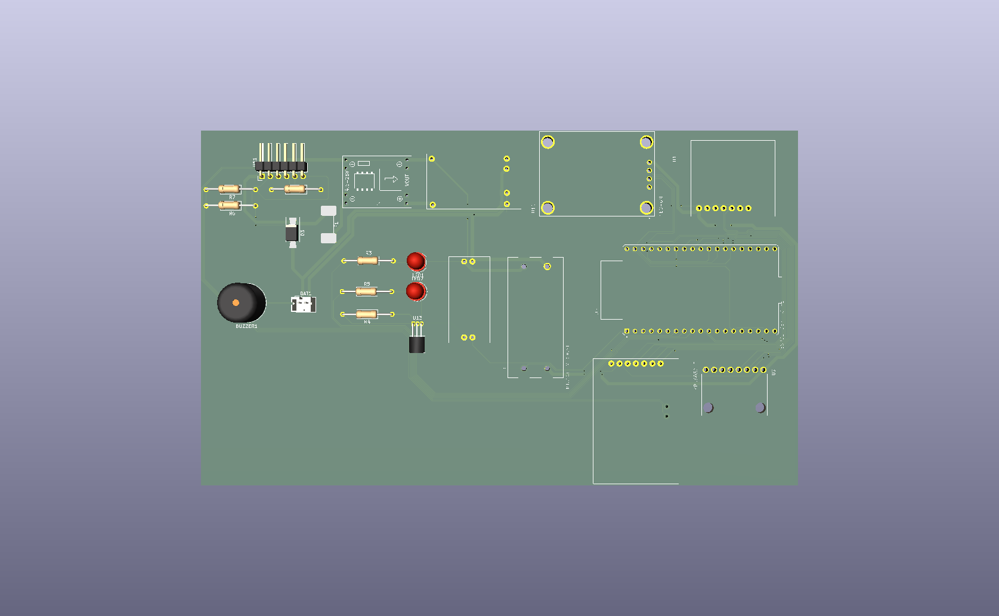
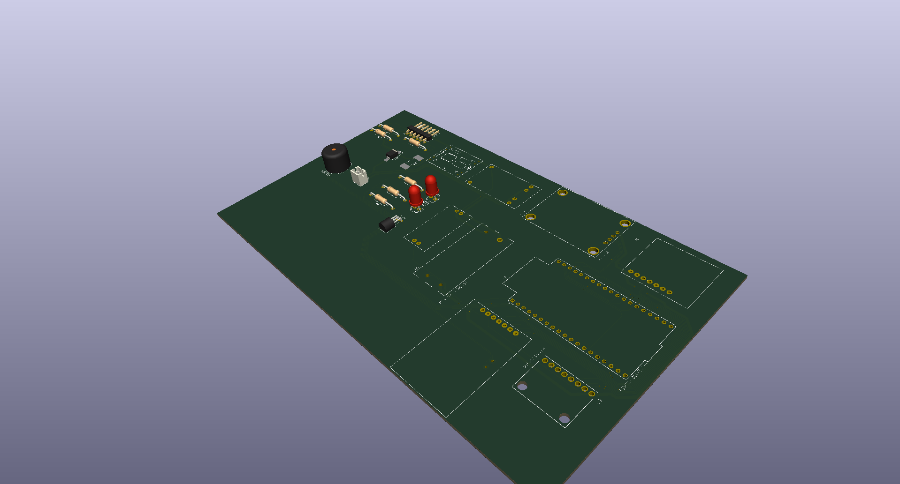
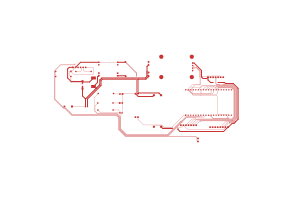

## Overview

EV Fleet Guardian is an IoT-based automotive telematics system designed for real-time monitoring and management of electric vehicle fleets.

The system collects vehicle telemetry through the CAN bus, tracks vehicle location using GPS, monitors battery parameters, and uploads data to the cloud for fleet monitoring and analytics.

## Features

* Real-time vehicle tracking
* CAN Bus vehicle data acquisition
* Battery monitoring
* Driver behavior analysis
* GPS geofencing
* GSM-based remote communication
* Custom PCB design
* Automotive power management

## Hardware Components

* ESP32
* MCP2515 CAN Controller
* TJA1050 CAN Transceiver
* NEO-6M GPS Module
* SIM800L GSM Module
* MPU6050 IMU
* MP1584 Buck Converter
* TP4056 Charging Module

## PCB Design

| Top 3D Render | Isometric View |
|---|---|
|  |  |

**PCB Layout (Top Copper + Silkscreen)**

Full KiCad source files: [`Hardware/KiCad-Source/`](Hardware/KiCad-Source/)

Manufacturing files (Gerbers + drill files): [`Hardware/PCB-Gerbers/EV_Guardian_Carrier_Gerbers.zip`](Hardware/PCB-Gerbers/EV_Guardian_Carrier_Gerbers.zip)

## Communication Protocols

* CAN Bus
* SPI
* I2C
* UART
* AT Commands

## Project Structure

* Documentation
* Hardware Design
* PCB Files
* Schematics

## Current Status

Prototype Development and Validation

## Future Improvements

* Predictive Battery Health Analytics
* Cloud Dashboard
* Mobile Application
* Fleet Performance Analytics
